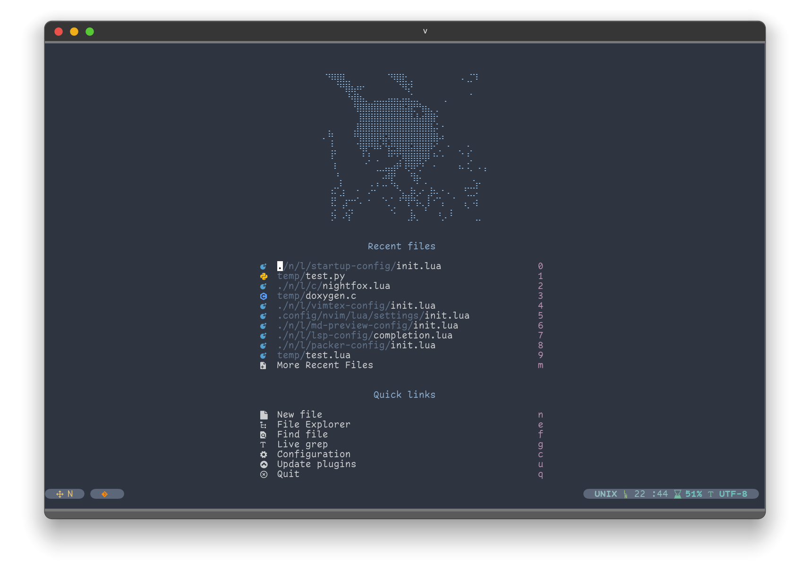
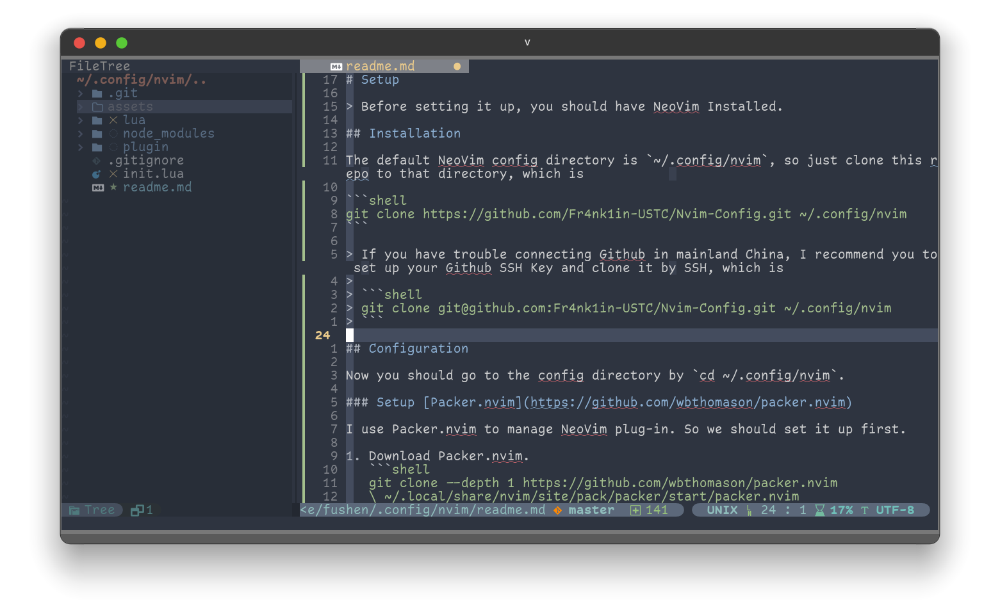
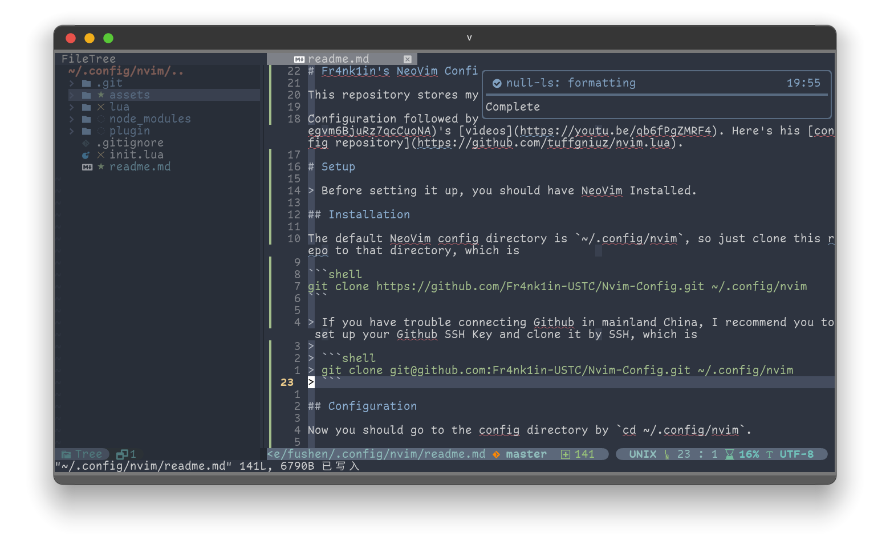
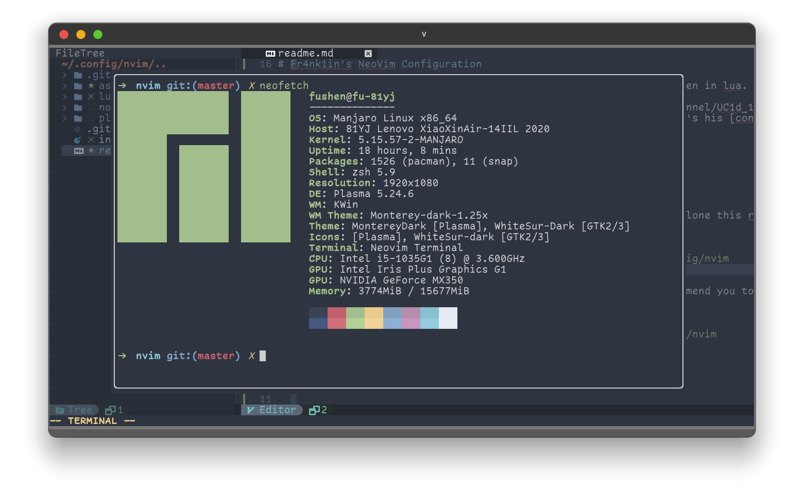
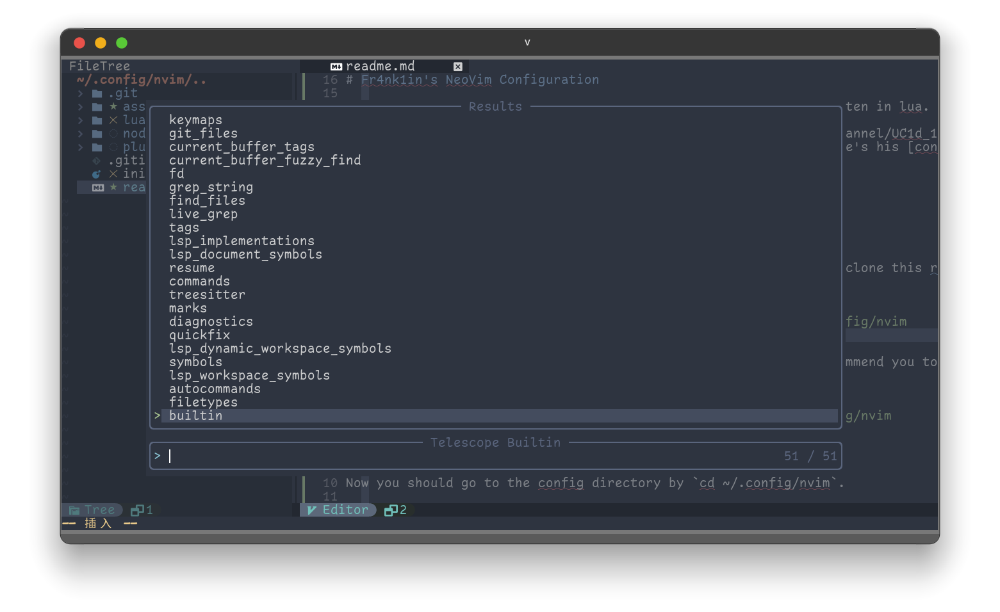
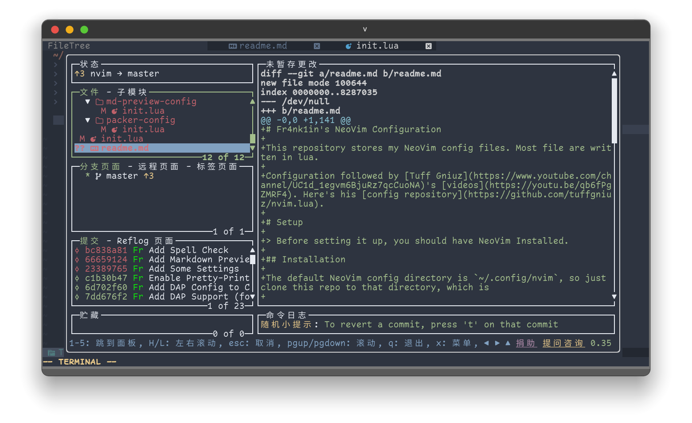
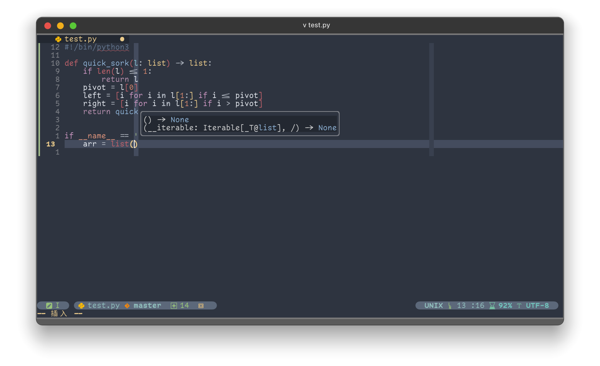
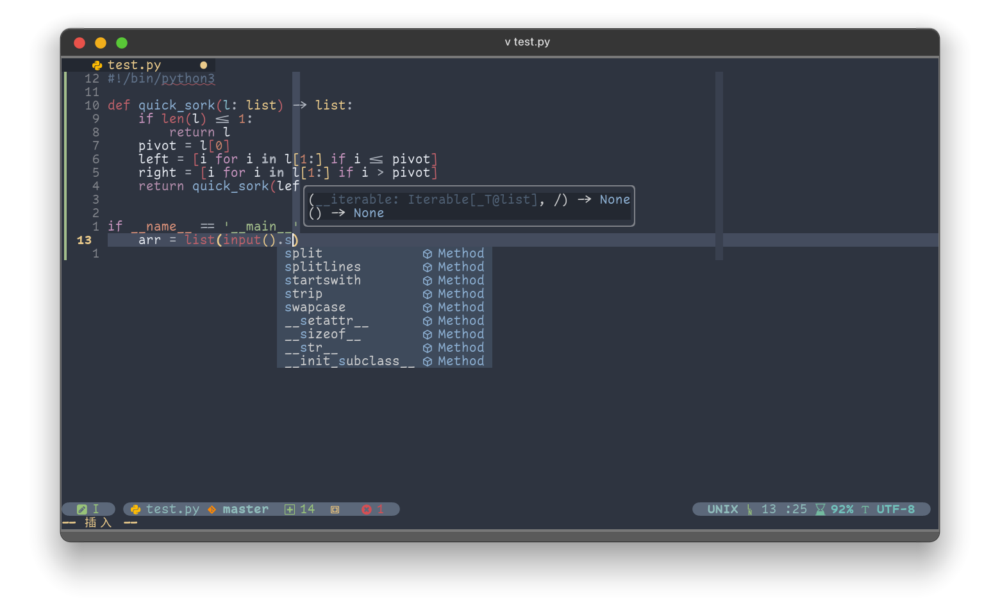
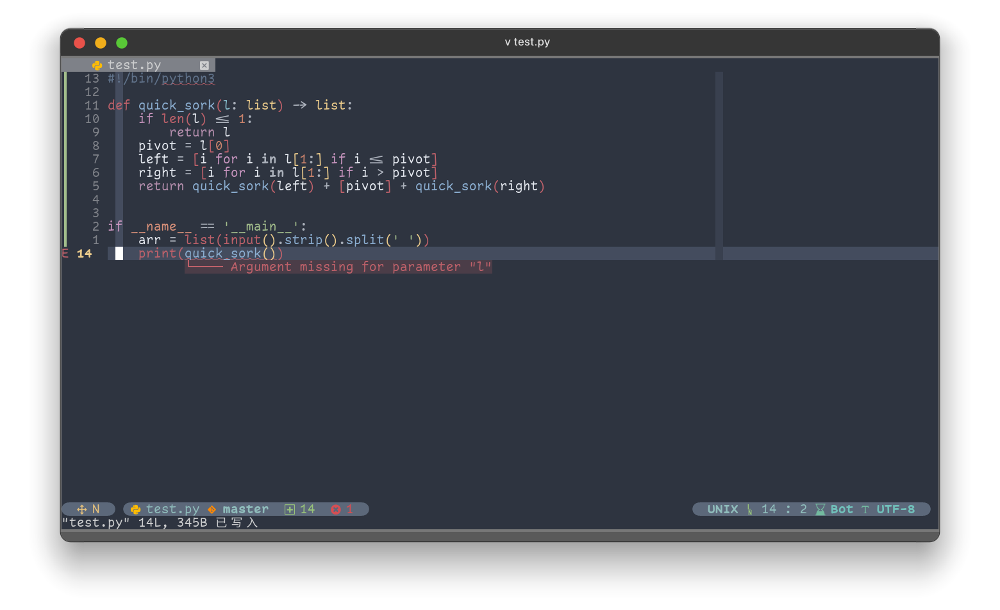
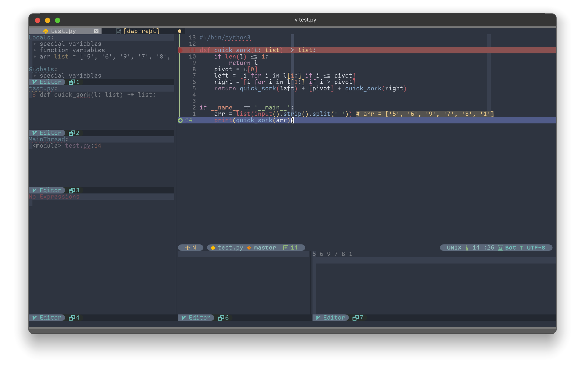

# Fr4nk1in's Nevis Configuration

This repository stores my NeoVim config files. Most file are written in lua.

Configuration followed by [Tuff Gniuz](https://www.youtube.com/channel/UC1d_1egvm6BjuRz7qcCuoNA)'s [videos](https://youtu.be/qb6fPgZMRF4). Here's his [config repository](https://github.com/tuffgniuz/nvim.lua).

# Setup

> Before setting it up, you should have NeoVim Installed.

## Installation

The default NeoVim config directory is `~/.config/nvim`, so just clone this repo to that directory, which is

```shell
git clone https://github.com/Fr4nk1in-USTC/Nvim-Config.git ~/.config/nvim
```

> If you have trouble connecting Github in mainland China, I recommend you to set up your Github SSH Key and clone it by SSH, which is
>
> ```shell
> git clone git@github.com:Fr4nk1in-USTC/Nvim-Config.git ~/.config/nvim
> ```

## Configuration

Now you should go to the config directory by `cd ~/.config/nvim`.

### Setup [Packer.nvim](https://github.com/wbthomason/packer.nvim)

I use Packer.nvim to manage NeoVim plug-in. So we should set it up first.

1. Download Packer.nvim.
   ```shell
   git clone --depth 1 https://github.com/wbthomason/packer.nvim
   \ ~/.local/share/nvim/site/pack/packer/start/packer.nvim
   ```
   > For those who have network issues:
   >
   > ```
   > git clone --depth 1 git@github.com:wbthomason/packer.nvim.git
   > \ ~/.local/share/nvim/site/pack/packer/start/packer.nvim
   > ```
2. Set up all the plug-ins. Make sure you're in `~/.config/nvim` now.
   1. Open `./lua/packer-config/init.lua` by NeoVim:
      ```shell
      nvim ./lua/packer-config/init.lua
      ```
      It's okay if you see a lot of error message popping up. Just ignore them.
   2. In **normal** mode (which you can see a `Normal` in the left-bottom of the terminal), type `:luafile %` and enter. Then type `:PackerSync` and enter.
      > If you have network issue, add the following content at the **beginning** of the file. You can press `i` in **normal** mode to get into **insert** mode and press `esc` to get back to **normal** mode.
      >
      > ```lua
      > packer.init({
      >     git = {
      >         default_url_format = "git@github.com:%s"
      >     }
      > })
      > ```
      >
      > Type `:wq` in **normal** mode to save the file and quit NeoVim. And then reopen Neovim and repeat the operation above.
   3. Once all plug-ins are installed, press `q` to exit the installation tab, and type `:qa` to quit NeoVim.
   4. Open NeoVim again and all the stuff should be set well.

### Customization

The structure of configuration files is clear. The `./init.lua` file imports all the configuration in `./lua`. NeoVim settings are in `./lua/settings/init.lua` and plug-in-irrelevant keymappings are in `./lua/mappings/init.lua`.

Most folders in `./lua` contains plug-in-specific configuation files. In other word, `./lua/<plugin-name>/*.lua` is the configuration file of plug-in `<plugin-name>`.

The plug-in-specific configuration file contains

- Plug-in configuration.
- Plug-in-related keymapping.

You can customize as you want.

# Plug-ins

- Plug-in Management
  - [Packer.nvim](https://github.com/wbthomason/packer.nvim)
- Required by others
  - [plenary.nvim](https://github.com/nvim-lua/plenary.nvim) for asynchronous programming.
  - [Nvim-web-devicons](https://github.com/kyazdani42/nvim-web-devicons) for icon support.
- Colorscheme
  - [Nightfox](https://github.com/EdenEast/nightfox.nvim)
- Auto-close brackets and etc.
  - [nvim-autopairs](https://github.com/windwp/nvim-autopairs)
- File Explorer
  - [nvim-tree.lua](https://github.com/kyazdani42/nvim-tree.lua)
- Status-line
  - [galaxyline.nvim](https://github.com/glepnir/galaxyline.nvim)
- Buffer-line
  - [barbar.nvim](https://github.com/romgrk/barbar.nvim)
- LSP Support, Diagnostic, Auto-completion and etc.
  - [nvim-lspconfig](https://github.com/neovim/nvim-lspconfig) for LSP basics.
  - [nvim-cmp](https://github.com/hrsh7th/nvim-cmp) for auto-completion.
  - [cmp-nvim-lsp](https://github.com/hrsh7th/cmp-nvim-lsp) for LSP source for nvim-cmp.
  - [cmp_luasnip](https://github.com/saadparwaiz1/cmp_luasnip) for snippet source for nvim-cmp.
  - [LuaSnip](https://github.com/L3MON4D3/LuaSnip) for snippets plugin.
  - [lspkind-nvim](https://github.com/onsails/lspkind.nvim) for snippet icons.
  - [mason.nvim](https://github.com/williamboman/mason.nvim) for easier LSP management.
  - [mason-lspconfig.nvim](https://github.com/williamboman/mason-lspconfig.nvim) bridges mason with lspconfig.
  - [lspsaga](https://github.com/glepnir/lspsaga.nvim) for better LSP TUI.
  - [lsp_lines.nvim](https://git.sr.ht/~whynothugo/lsp_lines.nvim) for better diagnostic TUI.
  - [lsp_signature.nvim](https://github.com/ray-x/lsp_signature.nvim) for better signature help.
- Debugger Adapter
  - [nvim-dap](https://github.com/mfussenegger/nvim-dap) for DAP client.
  - [nvim-dap-ui](https://github.com/rcarriga/nvim-dap-ui) for debugging UI.
  - [nvim-dap-virtual-text](https://github.com/theHamsta/nvim-dap-virtual-text) for debugging virtual text.
- Auto Formatting
  - [null-ls.nvim](https://github.com/jose-elias-alvarez/null-ls.nvim)
- Code Runner
  - [Code_Runner](https://github.com/CRAG666/code_runner.nvim)
- Syntax Highlighting
  - [nvim-treesitter](https://github.com/nvim-treesitter/nvim-treesitter) for language syntax highlighting.
  - [nvim-treesitter-refactor](https://github.com/nvim-treesitter/nvim-treesitter-refactor) for treesitter management.
  - [nvim-ts-rainbow](https://github.com/p00f/nvim-ts-rainbow) for bracket coloring.
- Special Language Support
  - [vim-jsonc](https://github.com/kevinoid/vim-jsonc) for JSON with comment.
  - [markdown-preview.nvim](https://github.com/iamcco/markdown-preview.nvim) for markdown preview support.
  - [VimTeX](https://github.com/lervag/vimtex) for TeX support.
- Startup
  - [alpha-nvim](https://github.com/goolord/alpha-nvim)
- Notification
  - [nvim-notify](https://github.com/rcarriga/nvim-notify)
- Fuzzy Finder
  - [telescope.nvim](https://github.com/nvim-telescope/telescope.nvim)
- Integrated Terminal
  - [toggleterm.nvim](https://github.com/akinsho/toggleterm.nvim)
- Git
  - [lazygit.nvim](https://github.com/kdheepak/lazygit.nvim) for calling lazygit in NeoVim.
  - [gitsigns.nvim](https://github.com/lewis6991/gitsigns.nvim) for git decorations (git blame and etc).
- Others
  - [Comment.nvim](https://github.com/numToStr/Comment.nvim) for quick comment lines and blocks.
  - [shade.nvim](https://github.com/sunjon/Shade.nvim) for dimming inactive windows.
  - [copilot.vim](https://github.com/github/copilot.vim) for Github Copilot integration.

# Screenshots

## Startup Window



## Basic



## Pop-up Windows

### Notification



### Terminal



### Telescope



### Lazygit



## Coding

### Function Signature



### Hint



### Diagnostic



### Debugging



# Reference

Configuration followed by [Tuff Gniuz](https://www.youtube.com/channel/UC1d_1egvm6BjuRz7qcCuoNA)'s [videos](https://youtu.be/qb6fPgZMRF4). Here's his [config repository](https://github.com/tuffgniuz/nvim.lua).
